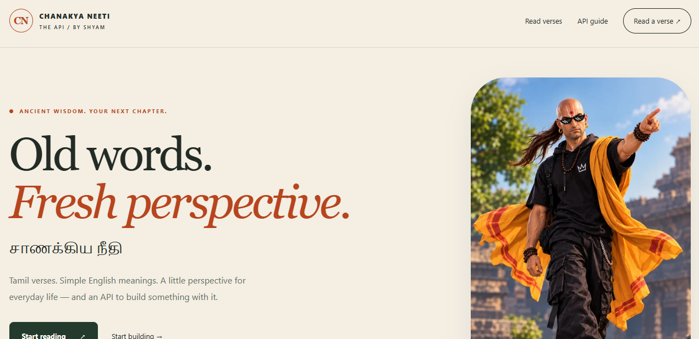
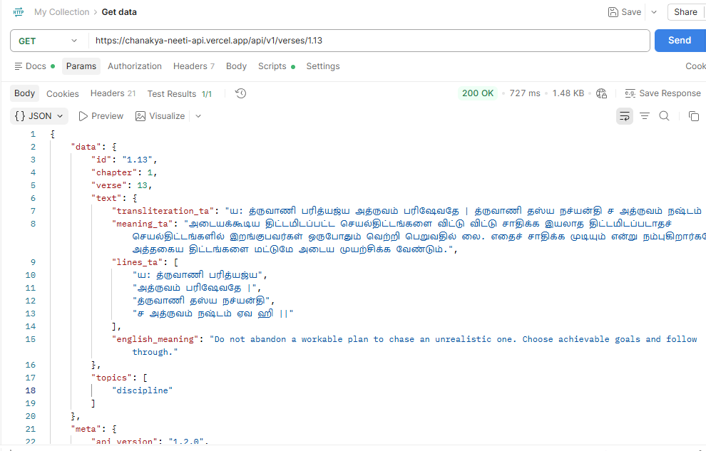

<div align="center">


# சாணக்கிய நீதி

### Chanakya Neeti API

**Old words. Fresh perspective.**

Tamil verses · Simple English meanings · An API you can build with

[](package.json)
[](package.json)
[](https://chanakya-neeti-api.vercel.app/read/1.1#browse)
[](https://chanakya-neeti-api.vercel.app/#browse)
[](LICENSE)
[](package.json)

**[Start reading →](https://chanakya-neeti-api.vercel.app/read/1.1#browse)** &nbsp; · &nbsp; **[Live website](https://chanakya-neeti-api.vercel.app)** &nbsp; · &nbsp; **[API guide](https://chanakya-neeti-api.vercel.app/docs)** &nbsp; · &nbsp; **[Try an endpoint](https://chanakya-neeti-api.vercel.app/api/v1/verses/10.15)**

Developed by **Shyam**  
© 2026 Shyam · All rights reserved.

</div>

---

## A little perspective. One verse at a time.

Explore **319 verses across 17 chapters** with Tamil-script text, Tamil explanations and individual English meanings. Read them in a simple numbered browser, or use the REST API in your own website, app or daily-reading project.

| For readers | For developers |
| :--- | :--- |
| Choose a chapter and tap a verse number | Versioned, read-only REST endpoints |
| Read Tamil and English together | Search Tamil text and English meanings |
| Move with **Previous** and **Next** | Daily, random, batch and related verses |
| See your position, such as **1 of 319** | Pagination, filters and JSON/NDJSON exports |
| Open a direct link to any available verse | Optional API keys, CORS controls and ETags |

The English field explains the idea in short, modern language. It is an interpretation, not a word-for-word translation.

## See it in action

Click either screenshot to open the original image and zoom in.

### Website preview

Tamil verses, simple English meanings and a numbered reader in one place.

[](docs/images/website-preview.png)

### API response

A successful `GET /api/v1/verses/1.13` request returning Tamil text, verse lines and an English explanation.

[](docs/images/api-response.png)

## Complete project wiki

Explore the [full wiki](https://github.com/961222243021-sudo/chanakya-neeti-api/wiki) for reader instructions, detailed endpoint behavior, examples, deployment, troubleshooting, architecture and contributing. Includes navigation, a copyright footer and an exporter for GitHub Wiki publication.

## Pick your starting point

- **I want to read:** open [verse 1](https://chanakya-neeti-api.vercel.app/read/1.1#browse), then press **Next**.
- **I want to build:** copy the [first request](#your-first-api-request).
- **I want to run it locally:** follow [local setup](#run-locally).
- **I want to deploy:** use the [Vercel configuration](#deploy-on-vercel).

<details>
<summary><strong>Browse the full guide</strong></summary>

- [Read without writing code](#read-without-writing-code)
- [Your first API request](#your-first-api-request)
- [Understand the response](#understand-the-response)
- [Every endpoint](#every-endpoint)
- [Parameters and filters](#parameters-and-filters)
- [Build with JavaScript or Python](#build-with-javascript-or-python)
- [Pagination and exports](#pagination-and-exports)
- [Errors and caching](#errors-and-caching)
- [Run locally](#run-locally)
- [Deploy on Vercel](#deploy-on-vercel)
- [Configuration](#configuration)
- [Project structure](#project-structure)
- [Verification and contributing](#verification-and-contributing)

</details>

## Read without writing code

1. Open the [reader](https://chanakya-neeti-api.vercel.app/read/1.1#browse).
2. Choose **Chapter 1–17** from the chapter selector.
3. Tap a numbered verse, or use the verse selector.
4. Read the Tamil text, Tamil meaning and plain-English explanation.
5. Press **Next** or **Previous** to continue.

**No URL editing. No JSON knowledge needed.** Next automatically continues into the following chapter and skips unavailable verse numbers. The numbered links work without JavaScript; selectors offer another way to navigate.

Unknown pages and unavailable reader verses show an illustrated 404 page with working **Home**, **Start reading** and **Go back** controls.

## Your first API request

**Base URL**

```text
https://chanakya-neeti-api.vercel.app/api/v1
```

**Get one verse**

```sh
curl 'https://chanakya-neeti-api.vercel.app/api/v1/verses/10.15'
```

```js
const response = await fetch(
  'https://chanakya-neeti-api.vercel.app/api/v1/verses/10.15'
);
const payload = await response.json();

if (!response.ok) throw new Error(payload.error.message);

console.log(payload.data.text.english_meaning);
```

> **How IDs work:** `"10.15"` means chapter **10**, verse **15**. Keep IDs as strings. Use the chapter index to find available verse numbers.

Public access needs no key unless the owner enables one. The API supports **GET**, **HEAD** and **OPTIONS**.

## Understand the response

A single-verse request returns the verse in `data` and version/developer information in `meta`.

```json
{
  "data": {
    "id": "10.15",
    "chapter": 10,
    "verse": 15,
    "text": {
      "transliteration_ta": "ஏக வ்ருக்ஷ ஸம ஆரூடா நானாவர்ணா விஹங்கமா: | ப்ராபாதே திக்ஷு தசஸு யான்தி கா தத்ர வேதனா ||",
      "meaning_ta": "பலவகைப் பறவைகள் ஒன்று கூடி ஓர் இரவை ஒரு மரத்தில் கழிக்கின்றன. அவை பல வண்ணம் கொண்டவை; பல இனத்தவை. கூடியிருந்த அவையனைத்தும் விடிந்ததும் பல்வேறு திசைகளில் பறந்து போய்விடுவன. இதில் துக்கப்படுவதற்கு என்ன இருக்கிறது? பிரிவு இயல்பானது. அதற்குத் துக்கப்படுவதேன்? துயரப்படுவதேன்?",
      "lines_ta": [
        "ஏக வ்ருக்ஷ ஸம ஆரூடா",
        "நானாவர்ணா விஹங்கமா: |",
        "ப்ராபாதே திக்ஷு தசஸு",
        "யான்தி கா தத்ர வேதனா ||"
      ],
      "english_meaning": "People can share a chapter of life and then go their separate ways, like birds leaving the same tree in the morning. Appreciate the time together; moving on is natural, even when it hurts."
    },
    "topics": [
      "resilience"
    ]
  },
  "meta": {
    "api_version": "1.2.0",
    "dataset_version": "c8391e0a84931676",
    "developed_by": "Shyam"
  }
}
```

| Field | Type | Use |
| :--- | :--- | :--- |
| `id` | String | Stable chapter-and-verse identifier |
| `chapter`, `verse` | Integers | Numbered location in the collection |
| `text.transliteration_ta` | String | Tamil-script verse, flattened into one line |
| `text.lines_ta` | String array | Verse lines in display order |
| `text.meaning_ta` | String | Tamil explanation |
| `text.english_meaning` | String | Short, accessible English interpretation |
| `topics` | String array | Discovery tags; may be empty |
| `meta.api_version` | String | API contract version |
| `meta.dataset_version` | String | Content checksum version |
| `meta.developed_by` | String | Developer credit: Shyam |

Every public verse object includes both meanings. Use `lines_ta` for layout and insert strings with `textContent` in HTML. Parsing JSON handles escape sequences; avoid manually modifying the raw response.

**Want plain text?** Add `?format=text` to a single-verse or daily request. It includes the verse lines and both meanings with actual line breaks.

## Every endpoint

Paths below are relative to the website domain. All requests use GET.

| Endpoint | What it does | Where to read the result |
| :--- | :--- | :--- |
| `/api/v1` | API overview and collection counts | `data` |
| `/api/v1/verses/{id}` | One verse | `data` |
| `/api/v1/verses` | Browse and search | `data.results[]`, `data.pagination` |
| `/api/v1/verses/{id}/related` | Verses with shared topics | `data.results[]` → `verse`, `shared_topics` |
| `/api/v1/daily` | One daily verse, using Asia/Kolkata | `data.verse`, `data.date`, `data.timezone` |
| `/api/v1/random` | Unique random verses | `data[]`, even when count is 1 |
| `/api/v1/chapters` | Chapter counts and available verse numbers | `data[]` |
| `/api/v1/chapters/{chapter}` | Browse one chapter | `data.chapter`, `data.results[]`, `data.pagination` |
| `/api/v1/topics` | Valid topic IDs and counts | `data[]` |
| `/api/v1/batch` | Several verses in requested order | `data[]` |
| `/api/v1/export` | Download all or filtered verses | JSON: `records[]`; NDJSON: one verse per line |
| `/api/v1/quality` | Integrity and editorial-status summary | `data` |
| `/health` | Service status and counts | `data.status` |

**Website routes:** `/` for the homepage, `/docs` or `/api/docs` for the guide, and `/read/{id}` for a verse reader.

<details>
<summary><strong>Parameters accepted by each endpoint</strong></summary>

| Endpoint | Accepted parameters |
| :--- | :--- |
| Single verse | `format`, `include_raw` |
| Browse/search | Filters, `q`, `match`, `page`, `limit`, `include_raw` |
| Related | `limit` |
| Daily | Filters, `date`, `format`, `include_raw` |
| Random | Filters, `count`, `include_raw` |
| Chapter browse | `page`, `limit`, `include_raw` |
| Batch | `ids` required, `include_raw` |
| Export | Filters, `format`, `include_raw` |
| Overview, chapter index, topics, quality, health | No query parameters needed |

“Filters” means `chapter`, `topic` and `review`. Combine them on browse, daily, random and export endpoints.

</details>

## Parameters and filters

| Parameter | Allowed values | Default / behavior |
| :--- | :--- | :--- |
| `chapter` | Integer 1–17 | Omitted: all chapters |
| `topic` | Exact ID from `/api/v1/topics` | Omitted: all topics |
| `review` | `reviewed`, `unreviewed` | Omitted: both |
| `q` | 1–200 characters | Searches Tamil text, English meanings and topic keywords |
| `match` | `all`, `any` | `all`; applies when `q` is present |
| `page` | Integer 1–1,000,000 | 1 |
| `limit` | Browse/chapter: 1–100; related: 1–20 | Browse/chapter: 20; related: 5 |
| `count` | Random: 1–20 | 1; unique within the request |
| `date` | Real `YYYY-MM-DD` date | Today in Asia/Kolkata |
| `ids` | 1–50 comma-separated IDs | Required for batch; preserves order and duplicates |
| `format` | Single/daily: `json`, `text`; export: `json`, `ndjson` | `json` |
| `include_raw` | `true`, `false` | `false`; adds optional `raw_text` |

Search is case-insensitive, Unicode-normalized keyword matching. Spaces or commas separate query words. `match=all` requires every word; `match=any` requires at least one. Filters combine with AND. Related results use shared topic tags, not semantic similarity.

**Copy a useful request**

```text
/api/v1/verses?chapter=1&topic=money&limit=5
/api/v1/verses?q=learning%20patience&match=any&limit=5
/api/v1/daily?date=2026-10-08&topic=resilience
/api/v1/random?chapter=10&count=2
/api/v1/batch?ids=1.6,10.15
/api/v1/verses/10.15?format=text
/api/v1/export?format=ndjson&chapter=10
```

<details>
<summary><strong>Selection rules and edge cases</strong></summary>

- Daily selection stays the same for the same date, filters and content version. A content update can change the selected verse.
- Random returns 404 if the matching pool is smaller than `count`.
- A batch fails as a whole if any ID is invalid or unavailable.
- Browse with no matches returns an empty `results` array and `pages: 0`.
- A page beyond the last page returns an empty array.
- Unavailable verse numbers return 404; use the chapter index or the numbered reader.
- Unsupported, repeated or invalid parameters on validated endpoints return 400.

</details>

## Build with JavaScript or Python

### Search Tamil or English

Use `URLSearchParams` to encode query values correctly.

```js
const url = new URL(
  '/api/v1/verses', 'https://chanakya-neeti-api.vercel.app'
);
url.search = new URLSearchParams({ q: 'பணம்', limit: '5' });

const response = await fetch(url);
const payload = await response.json();
if (!response.ok) throw new Error(payload.error.message);

for (const verse of payload.data.results) {
  console.log(verse.id, verse.text.english_meaning);
}
```

### Display a verse on your page

Add `<div id="verse"></div>` to the page, then run:

```js
async function showVerse() {
  const response = await fetch(
    'https://chanakya-neeti-api.vercel.app/api/v1/verses/10.15'
  );
  const payload = await response.json();
  if (!response.ok) throw new Error(payload.error.message);

  const container = document.getElementById('verse');
  const { text } = payload.data;
  container.replaceChildren();

  for (const line of text.lines_ta) {
    const p = document.createElement('p');
    p.lang = 'ta';
    p.textContent = line;
    container.append(p);
  }

  for (const [field, language] of [
    ['meaning_ta', 'ta'], ['english_meaning', 'en']
  ]) {
    const p = document.createElement('p');
    p.lang = language;
    p.textContent = text[field];
    container.append(p);
  }
}

showVerse().catch(error => {
  document.getElementById('verse').textContent = error.message;
});
```

### Python, with no extra packages

```python
import json
from urllib.request import urlopen
from urllib.error import HTTPError, URLError

url = 'https://chanakya-neeti-api.vercel.app/api/v1/verses/10.15'

try:
    with urlopen(url, timeout=15) as response:
        verse = json.load(response)['data']
    print('\n'.join(verse['text']['lines_ta']))
    print(verse['text']['meaning_ta'])
    print(verse['text']['english_meaning'])
except HTTPError as error:
    print(error.code, json.load(error)['error']['message'])
except URLError as error:
    print('Connection failed:', error.reason)
```

## Pagination and exports

### Browse the full collection

`data.pagination` contains `page`, `limit`, `total`, `pages` and `has_next`. Keep your filters unchanged between pages.

```js
const records = [];
let page = 1;

while (true) {
  const url = new URL(
    '/api/v1/verses', 'https://chanakya-neeti-api.vercel.app'
  );
  url.search = new URLSearchParams({ page: String(page), limit: '100' });
  const response = await fetch(url);
  const payload = await response.json();
  if (!response.ok) throw new Error(payload.error.message);

  records.push(...payload.data.results);
  if (!payload.data.pagination.has_next) break;
  page++;
}

console.log(records.length);
```

### Download once instead

```sh
# JSON collection: { dataset_version, records }
curl 'https://chanakya-neeti-api.vercel.app/api/v1/export' -o verses.json

# NDJSON: one complete verse per line
curl 'https://chanakya-neeti-api.vercel.app/api/v1/export?chapter=10&format=ndjson' \
  -o chapter-10.ndjson
```

Exports include English meanings and support filters. JSON exports use `records`, without a `data`/`meta` envelope. For NDJSON, split into nonempty lines and parse each line separately.

```js
const response = await fetch(
  'https://chanakya-neeti-api.vercel.app/api/v1/export?format=ndjson&chapter=10'
);
if (!response.ok) throw new Error((await response.json()).error.message);
const text = await response.text();
const verses = text.split('\n').filter(line => line.trim()).map(JSON.parse);
console.log(verses[0].text.english_meaning);
```

## Errors and caching

API errors return JSON. Missing website pages return the illustrated HTML 404.

```json
{
  "error": {
    "code": "VERSE_NOT_FOUND",
    "message": "Requested verse number is unavailable.",
    "request_id": "…"
  }
}
```

| HTTP status | Meaning / next step |
| :--- | :--- |
| `200` | Successful request |
| `204` | Successful OPTIONS preflight; no body |
| `304` | Content unchanged; reuse your saved body |
| `400` | Invalid input; read `error.message` |
| `401` | Supply the configured `x-api-key` |
| `404` | Route, verse or required candidates unavailable |
| `405` | Use GET, HEAD or OPTIONS |
| `414` | Request URL exceeds 4,096 characters |
| `500` | Unexpected error; report the request ID |

Most public responses use short caching and an `ETag`. Send the saved value in `If-None-Match`; a 304 has no body to parse. Random, health, error and key-protected responses use `no-store`. HEAD returns headers without a body. `x-request-id` identifies a request.

## Run locally

**Requires Node.js 24.** No runtime dependencies or database setup.

```sh
git clone https://github.com/961222243021-sudo/chanakya-neeti-api.git
cd chanakya-neeti-api
npm start
```

Open **http://localhost:3000**.

| Command | Purpose |
| :--- | :--- |
| `npm start` | Run the local HTTP server |
| `npm run dev` | Restart automatically when files change |
| `npm test` | Run the automated checks |
| `npm run check` | Validate collection integrity and English coverage |
| `npm run build` | Run the deployment validation step |

<details>
<summary><strong>Run with Docker</strong></summary>

```sh
docker build -t chanakya-neeti-api .
docker run --rm -p 3000:3000 chanakya-neeti-api
```

The supplied image uses Node.js 24 Alpine and runs as the `node` user. Docker execution has not been independently verified in this workspace.

</details>

## Deploy on Vercel

1. Import this GitHub repository into Vercel.
2. Select **Other** as the framework and **Node.js 24** as the runtime.
3. Keep the root directory at the repository root.
4. Let [`vercel.json`](vercel.json) supply the build command, output directory, routing and bundled files. Remove conflicting dashboard overrides.
5. Deploy, then check the homepage, `/health`, `/read/1.1` and `/api/v1/verses/10.15`.

| Setting | Repository configuration |
| :--- | :--- |
| Build command | `npm run build` |
| Output directory | `public` |
| Function entrypoint | `api/index.js` |
| Included files | `data/**`, `public/**` |
| Local server | `scripts/serve.mjs` |

Keep the slash between the domain and path: **`.vercel.app/api`**. The website generates complete example URLs from its own deployment origin.

## Configuration

All configuration is optional.

| Variable | Default | Purpose |
| :--- | :--- | :--- |
| `PORT` | `3000` | Local server port |
| `API_KEY` | Unset | Require `x-api-key` on `/api/v1` requests |
| `CORS_ORIGINS` | `*` | Comma-separated allowed browser origins |

To load a local environment file:

```sh
node --env-file=.env scripts/serve.mjs
```

Website pages, images and health stay public when an API key is enabled. Keep private keys on the server rather than in public frontend code.

```js
// Server-side example when your deployment requires a key.
const response = await fetch(
  'https://chanakya-neeti-api.vercel.app/api/v1/verses/10.15',
  { headers: { 'x-api-key': process.env.API_KEY } }
);
```

CORS allows all origins by default. It controls browser access; it is not a substitute for authentication. The API does not use cookies.

## Project structure

| Path | Responsibility |
| :--- | :--- |
| [`api/index.js`](api/index.js) | Vercel function entrypoint |
| [`src/app.mjs`](src/app.mjs) | Shared routing, validation and response handling |
| [`src/reader.mjs`](src/reader.mjs) | HTML reading view and numbered navigation |
| [`public/`](public/) | Homepage, scripts, styles and illustrations |
| [`data/english-meanings.json`](data/english-meanings.json) | Individual English explanations |
| [`scripts/serve.mjs`](scripts/serve.mjs) | Local HTTP adapter |
| [`scripts/validate-data.mjs`](scripts/validate-data.mjs) | Content integrity checks |
| [`test/`](test/) | API, reader, HTTP and deployment-entrypoint checks |
| [`vercel.json`](vercel.json) | Vercel deployment configuration |

## Verification and contributing

The latest local suite passed **47 checks**, including navigation through all 319 reader pages, chapter transitions, English coverage, examples, input validation, image delivery, 404 behavior and Vercel entrypoint handling.

Full editorial proofreading remains pending. Passing software checks does not establish independent linguistic accuracy or browser layout review. See the [verification record](docs/VERIFICATION.md) and [development plan](docs/DEVELOPMENT_PLAN.md).

Before proposing a change:

1. Run `npm test` and `npm run build`.
2. Keep verse IDs and available numbering intact.
3. Update examples when changing response behavior.
4. Keep English explanations concise and specific to their verses.

## License and copyright

**© 2026 Shyam. All rights reserved.**

This project uses the [Shyam Proprietary License](LICENSE). Copying, modifying, redistributing or commercially exploiting the project code or documentation requires prior written permission from Shyam, except where applicable law or the hosting platform terms permit it.

Public website and API access remain available for their intended purposes. Third-party materials and public-domain content are excluded from this ownership claim. See [LICENSE](LICENSE) for the complete terms.

---

<div align="center">

**சாணக்கிய நீதி · Developed by Shyam**  
© 2026 Shyam · All rights reserved.

[Read the first verse](https://chanakya-neeti-api.vercel.app/read/1.1#browse) &nbsp; · &nbsp; [Build with the API](https://chanakya-neeti-api.vercel.app/docs)

</div>
