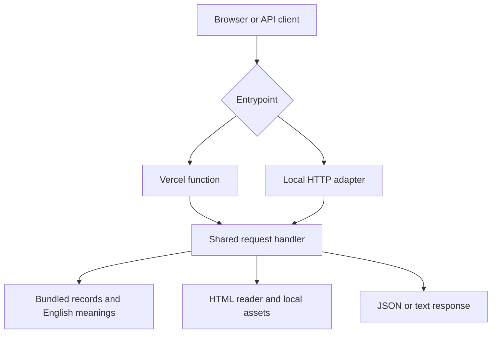

# Architecture

## Design

A read-only Node.js 24 app with one shared handler, bundled JSON records and local static assets. There is no database, runtime package dependency, user account system or external AI request per API call.

## Modules and responsibilities

| File | Responsibility |
| --- | --- |
| api/index.js | Vercel fetch entrypoint |
| scripts/serve.mjs | Local Node HTTP adapter |
| src/app.mjs | Routing, public response formatting, filtering, search, auth, CORS and caching |
| src/reader.mjs | Escaped HTML reader, numbered links, progress and previous/next |
| public/index.html | Homepage, first-verse fallback, playground and guide |
| public/client.js | Playground, safe response rendering and generated examples |
| public/browse.js | Chapter/verse selector navigation |
| public/404.html | Illustrated recovery page |
| public/not-found.js | Back button behavior |
| data/english-meanings.json | ID-to-English-explanation mapping |
| scripts/validate-data.mjs | Structural data integrity checks |

## Initialization and requests

Data and assets are loaded when the module initializes. A verse lookup map and a normalized search index are prepared in memory. API calls read the shared immutable collection and do not write user state.

Daily selection hashes the content version, date and candidate IDs. Random selection uses cryptographic random integer selection to sample without replacement. Related results count shared topic tags. The reader's neighbors come from the actual ordered collection, preserving gaps and chapter transitions.

## Public response boundary

Normal public verse responses expose identity, text and topics. Optional raw_text requires include_raw=true. The project keeps internal record fields out of normal verse objects. Website rendering escapes values before placing them in HTML; playground rendering uses textContent.

## Operational limits

Search scans the in-memory collection and is appropriate for this small bundled dataset. The app does not implement a distributed rate limiter, a persistent cache, writes, paid accounts or an editorial admin interface. Host-level controls can be configured separately when needed.

Next: [Testing and Contributing](Testing-and-Contributing.md).

---

[Wiki Home](Home.md) · Developed by **Shyam** · © 2026 Shyam. All rights reserved.
